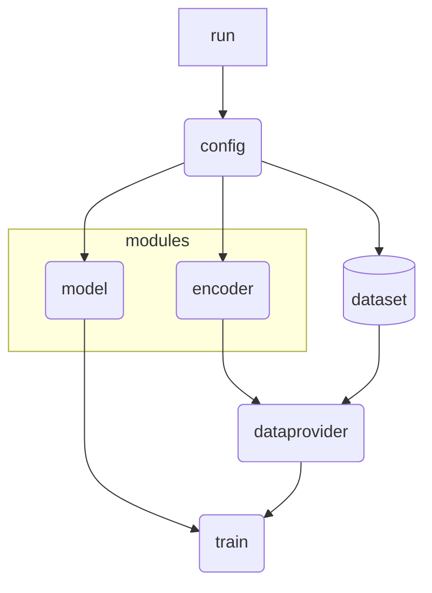

# Structure-based Prediction of Xenotransplantation Immunogenicity

## Introduction
Today, the demand for organ transplantation is increasing worldwide, but due to the limited number of donor organs, many efforts are being made.
Among them, xenotransplantation is currently being proposed as the most realistic alternative, and the biggest problem with xenotransplantation is the immune response.

On the other hand, immunogenicity prediction using deep learning technology is currently being actively studied, but there has been no research on immunogenicity in xenotransplantation.
Therefore, in our study, we aim to identify protein structures that can cause immunogenicity during xenotransplantation based on the latest structure-based deep learning technology.

## Workflow


## How to run
- Set the configuration in the `config.py` file.
    - For default, `config.py`' imports the `model.py` and `encoder.py` files located in the `code` directory.'
    - You can import your own `model.py` and `encoder.py` files just simply locating them in your working directory, or chainging the import path in the `config.py` file.
- You can run the code by running the `run.ipynb` or `run.sh` file.
    - If you want to run the code in the terminal, you can run the `run.sh` file by typing `bash run.sh` in the terminal.
    - If you want to run the code in the jupyter notebook, you can run the `run.ipynb` file by running the cells in the jupyter notebook.
    - You can also run the code in the terminal by running train.py file.
```bash
# Run the code in the terminal
python $CODE_PATH/train.py $CONFIG_PATH
```
```python
# Run the code in the jupyter notebook
from train import main as train
train('Path of the config file')
```

### Description of Selected Arguments in `config.py`
| Arguemnt | Description |
| --- | --- |
| model | Select specific class in `model.py` |
| encoder | Select specific class in `encoder.py` |
| epi_args | Arguments for epitope dataset. You can set the header name of epitope sequence, HLA name, and target in the dataset file. Specific sperator should be set according to the dataset file. (e.g. `,` or `\t`) |
| regularize | If the model has a regularization method, set it to True. (e.g. `model.DeepNeo`) |